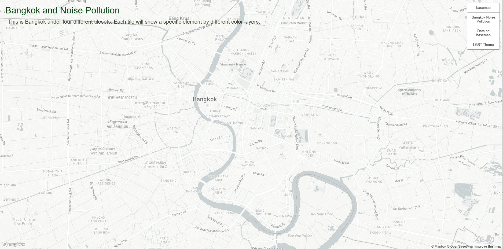
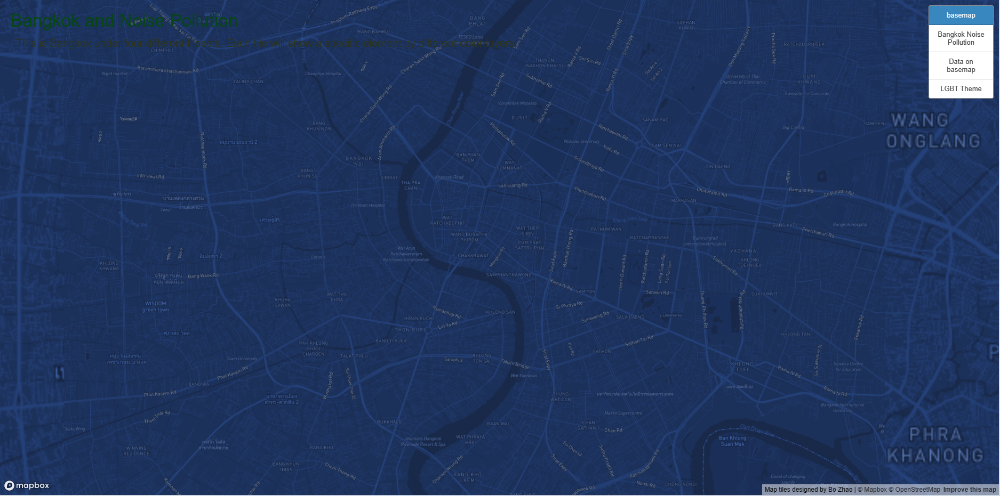
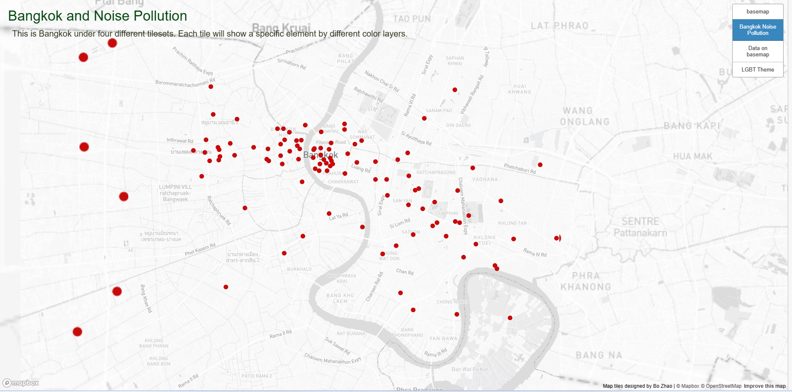
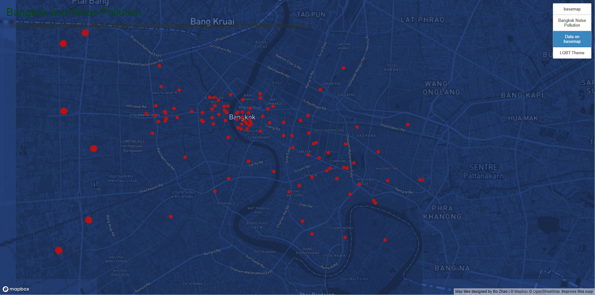
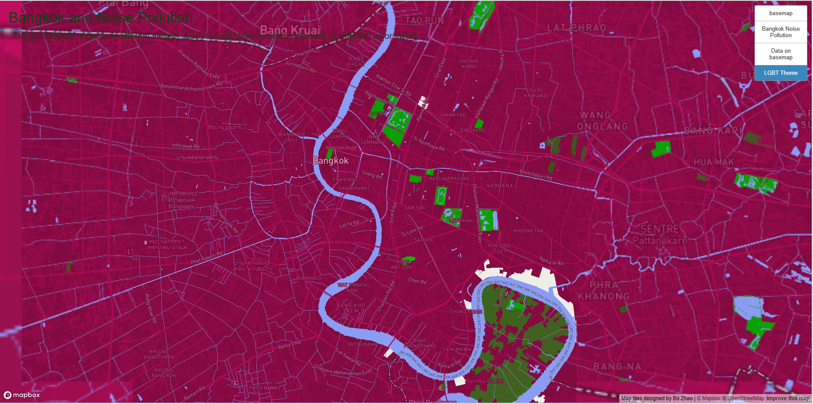

# Map-Design-and-Tile-Generation
## Bangkok 
In this lab, I design a web map of Bangkok with 4 tilesets.
[Bangkok Web Map Page](http://127.0.0.1:5500/index.html)

All the map below was scaled as 1:45000 
with the Mecator map projection EPSG: 3857.

### 1: Base map
The base map is monochrome style with very light color. This is super boring to me, so I made a little edit to change the base color to dark blue.
From this 

To this 

### 2: Thematic layer
The data input was made from Mapbox datasets and import to this map. The yellow dot show places have noise pollution in Bangkok. 
For this task, I import data to the basemap layer. The data is noise pollution in Bangkok which represented by red dot on the map. 

### 3: Composed of the thematic layer
In order to make the second tile on the first tile. I keep the base as tile 1- dark blue, and keep highlight data as red dots of tile 2 on this map.

### 4: Map layer designed over Mapbox
My theme is LGBT so the main color is strong pink as the base. I use light blue-purple for water, green for greenscape and white for comercial area.

 
